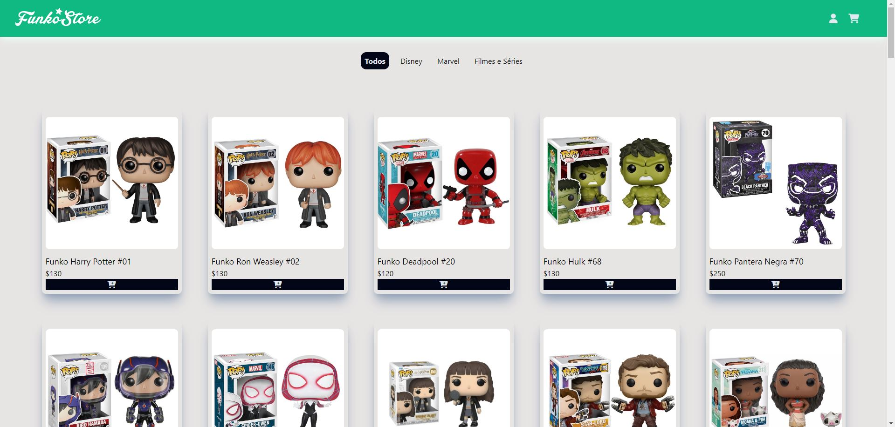
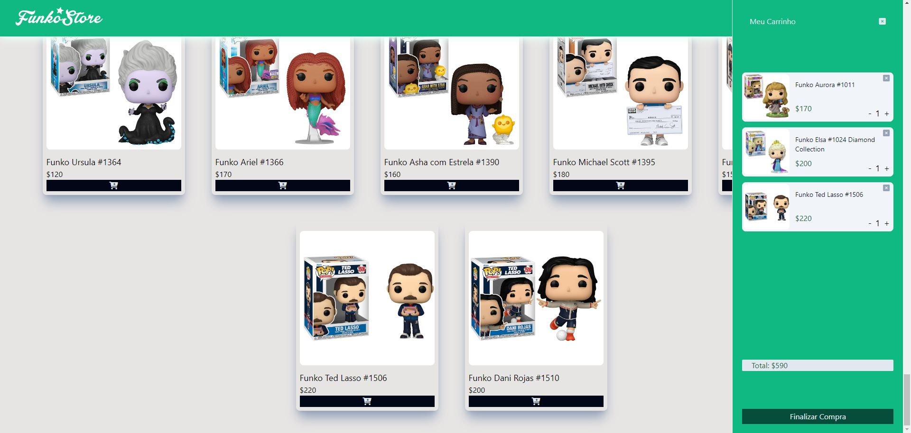
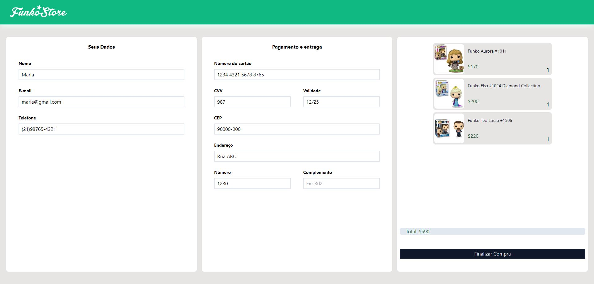
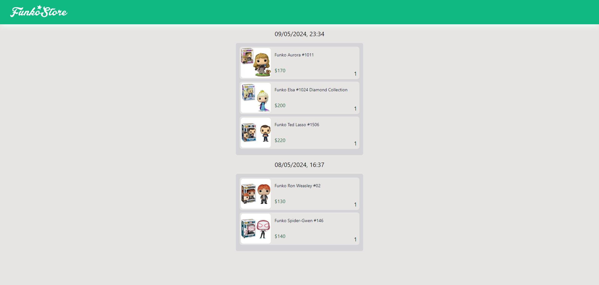

[HTML_BADGE]: https://img.shields.io/badge/html5-%23E34F26.svg?style=for-the-badge&logo=html5&logoColor=white
[CSS_BADGE]: https://img.shields.io/badge/css3-%231572B6.svg?style=for-the-badge&logo=css3&logoColor=white
[JAVASCRIPT_BADGE]: https://img.shields.io/badge/javascript-%23323330.svg?style=for-the-badge&logo=javascript&logoColor=%23F7DF1E
[VITE_BADGE]: https://img.shields.io/badge/vite-%23646CFF.svg?style=for-the-badge&logo=vite&logoColor=white
[REACT_BADGE]: https://img.shields.io/badge/react-%2320232a.svg?style=for-the-badge&logo=react&logoColor=%2361DAFB
[TAILWIND_BADGE]: https://img.shields.io/badge/tailwindcss-%2338B2AC.svg?style=for-the-badge&logo=tailwind-css&logoColor=white
[PROJECT__BADGE]: https://img.shields.io/badge/📱Visit_this_project-000?style=for-the-badge&logo=project
[PROJECT__URL]: https://brunaciarlo.github.io/lojaFunko/

<h1 align="center" style="font-weight: bold;">Projeto loja 🛒💻</h1>

🌐 <a href="#ingles"> _English README </a> below the portuguese_

![HTML_BADGE]
![CSS_BADGE]
![JAVASCRIPT_BADGE]
![VITE_BADGE]
![REACT_BADGE]
![TAILWIND_BADGE]

<p align="center">
  <a href="#sobre">Sobre</a> • 
  <a href="#comecando">Começando</a>
</p>

<p align="center">
  
  
  
  
</p>

<h2 id="sobre">📖 Sobre</h2>

Nesse projeto foi criada uma loja virtual na qual é possível filtrar os produtos por categorias, adicionar e remover produtos do carrinho - e modificar sua quantidade dentro do carrinho - enquanto o valor total da compra é atualizado em tempo real, simular a conclusão da compra e ver os pedidos realizados anteriormente.

[![project][PROJECT__BADGE]][PROJECT__URL]

<h4>🔒 Importante!</h4>
Nenhum dado inserido no checkout fica salvo em bancos de dados e os pedidos anteriores são armazenados em localstorage. É completamente seguro inserir dados reais ou fictícios no site.

<h4>📚 Estudo</h4>
Esse projeto é uma aplicação para estudo de desenvolvimento web front-end usado a ferramenta Vite.

<h2 id="comecando">🚀 Começando</h2>

Caso queira baixar o projeto para rodar na sua máquina, é necessário seguir os passos a seguir:

<h3>Pré-requisitos</h3>

- [NodeJS](https://nodejs.org/en) (versão 16.0.0 ou superior)

<h3>Clonando</h3>

Como clonar

```bash
git clone https://github.com/brunaciarlo/lojaFunko.git
```

Abrir a pasta do projeto clonado e digitar os seguintes comandos no terminal:

```bash
npm create vite@latest
```

Nomeie a aplicação como desejar (nome sugerido: loja-funko)

`Select a framework: » React`

`Select a variant: » Javascript`

```bash
cd nome-aplicacao
npm install
npm run dev
```
---------------------------------------------------------------------------------------------------------------------------------------

<h1 id="ingles" align="center" style="font-weight: bold;">Shopping Project 🛒💻</h1>

![HTML_BADGE]
![CSS_BADGE]
![JAVASCRIPT_BADGE]
![VITE_BADGE]
![REACT_BADGE]
![TAILWIND_BADGE]

<p align="center">
  <a href="#about">About</a> • 
  <a href="#starting">Getting Started</a>
</p>

<p align="center">
  
  
  
  
</p>

<h2 id="about">📖 About</h2>

This project is a virtual shop where you can filter products by categories, add and remove products from the shopping cart - and modify the quantity within the cart -  while the total price is updated in real-time, simulate the checkout and view previous orders.

[![project][PROJECT__BADGE]][PROJECT__URL]

<h4>🔒 Important!</h4>
Data inserted in checkout are not stored in any database and the previous orders are stored in localstorage. It's completaly safe to insert real ou non real data on the website.

<h4>📚 Study</h4>
This project is an apliccation with the purpose of front-end development study usying Vite.

<h2 id="starting">🚀 Getting Started</h2>

In case you want to download the code in your machine, follow the next steps:

<h3>Prerequisites</h3>

- [NodeJS](https://nodejs.org/en) (version 16.0.0 or later)

<h3>Cloning</h3>

How to clone

```bash
git clone https://github.com/brunaciarlo/lojaFunko.git
```

Open the project folder and type the following commands in the terminal:

```bash
npm create vite@latest
```

Name the application as you wish (sugestion: loja-funko)

`Select a framework: » React`

`Select a variant: » Javascript`

```bash
cd application-name
npm install
npm run dev
```
